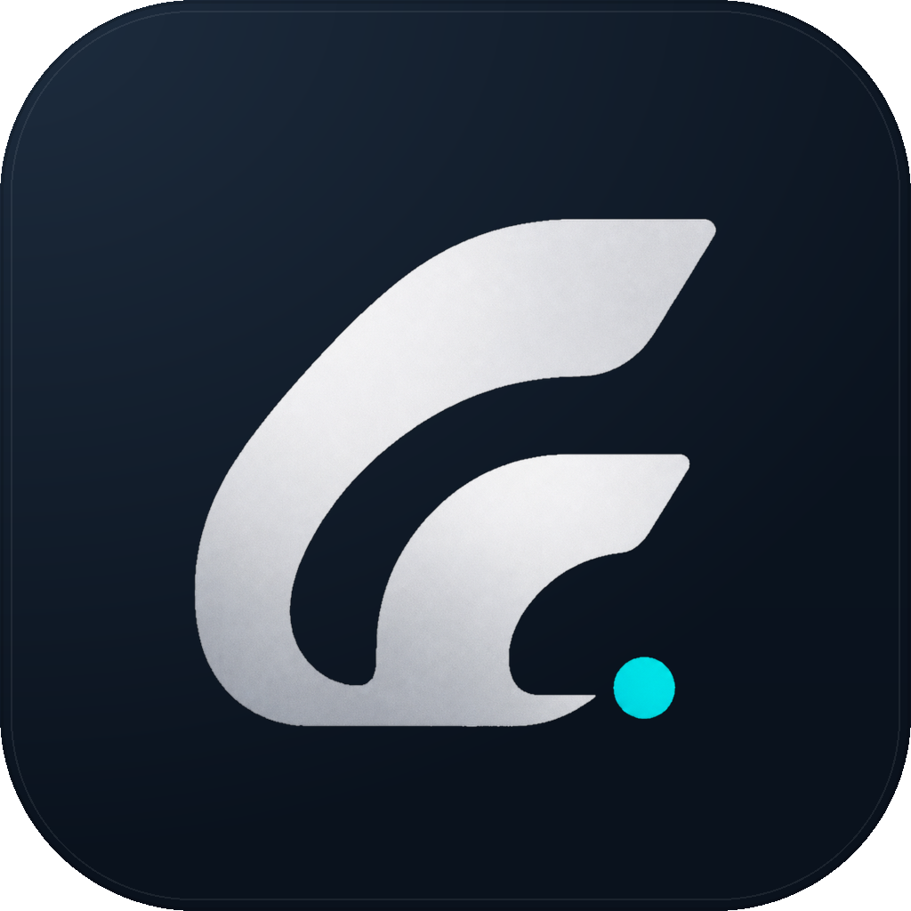

<p align="center">
  
</p>

<h1 align="center">巨鲸智能体</h1>

<p align="center">
  面向企业经营与增长场景的桌面 AI 智能体
</p>

<p align="center">
  <a href="https://whale-desk.com/">官方网站</a> ·
  <a href="https://github.com/cxhihilwb123-hash/jujing-agent/releases/tag/jujing-desktop-v0.19.0">下载安装</a> ·
  <a href="docs/jujing-release-flow.md">发布说明</a>
</p>

## 项目介绍

巨鲸智能体是巨鲸网络面向企业客户打造的桌面 AI 助手。它将大模型能力、任务规划、浏览器与本地工具、知识沉淀和持续执行整合到一个桌面应用中，帮助团队处理经营分析、增长获客、销售跟进、账号运营、资料整理和流程推进等工作。

本项目基于开源 [Hermes Agent](https://github.com/NousResearch/hermes-agent) 内核定制发行，并在其基础上完成巨鲸网络品牌包装、中文界面、企业场景文案、独立数据目录、桌面安装程序和受控更新通道。客户下载安装巨鲸智能体后即可使用，无需再单独安装 Hermes 桌面端。

## 主要能力

- **经营决策辅助**：拆解业务问题，整理背景信息，形成目标、方案、执行步骤和复盘材料。
- **增长与获客**：协助梳理目标客户、获客渠道、触达策略、销售话术和持续跟进计划。
- **账号与内容运营**：支持选题规划、内容生成、素材整理、账号运营和多阶段任务推进。
- **企业资料处理**：归纳文档与数据，提炼重点，生成报告、方案、清单和标准流程。
- **连续任务执行**：调用浏览器、本地文件和终端等工具，完成由多个步骤组成的工作。
- **经验持续沉淀**：保存常用资料、工作方法、业务规则和团队经验，减少重复沟通。

## 适用场景

| 场景 | 典型工作 |
| --- | --- |
| 企业经营 | 经营分析、问题诊断、方案制定、任务拆解 |
| 市场增长 | 客群研究、渠道规划、获客策略、活动方案 |
| 销售管理 | 线索整理、客户跟进、话术准备、过程复盘 |
| 账号运营 | 内容规划、素材整理、发布协同、运营复盘 |
| 组织管理 | 制度整理、会议纪要、流程建设、知识沉淀 |

## 下载与安装

当前桌面版本为 `0.19.0`：

| 平台 | 安装包 | 适用设备 |
| --- | --- | --- |
| macOS | `Jujing-Agent-0.19.0-mac-arm64.dmg` | Apple Silicon（M 系列芯片） |
| Windows | `Jujing-Agent-0.19.0-win-x64.exe` | Windows x64 |

请从以下官方渠道下载：

- [巨鲸智能体官方网站](https://whale-desk.com/)
- [GitHub Releases 发布页](https://github.com/cxhihilwb123-hash/jujing-agent/releases/tag/jujing-desktop-v0.19.0)
- [SHA256 校验文件](https://whale-desk.com/downloads/SHA256SUMS.txt)

在 Windows 上从源码安装或排查初始化问题时，可在 PowerShell 中运行
`scripts/install.ps1`；普通客户仍建议直接使用上表中的桌面安装包。

安装包已包含桌面应用和首次启动所需的初始化程序。首次打开时，应用会在独立目录中准备巨鲸智能体运行环境，不要求客户预先安装上游 Hermes。

> 当前版本尚未配置 Apple Developer ID 公证和 Windows 商业代码签名。macOS 可能要求用户通过“右键打开”或系统设置确认启动，Windows 可能显示 SmartScreen 提示。完成双平台正式签名后更适合大规模商业分发。

## 品牌与数据隔离

桌面端已完成以下品牌与产品化配置：

- 应用名称、图标、窗口标题、菜单和关于信息统一为“巨鲸智能体”
- 默认使用中文界面和企业业务场景文案
- macOS Bundle ID：`com.jujing.network.agent`
- 应用协议：`jujing-agent`
- 运行数据与上游 Hermes CLI 隔离

默认数据目录：

- macOS：`~/.jujing-agent`
- Windows：`%LOCALAPPDATA%\jujing-agent`

因此，同一台电脑已经安装上游 Hermes CLI 时，仍可以同时安装巨鲸智能体桌面版。两者使用不同的数据目录，不会覆盖对方的配置、会话和运行数据。

## 更新机制

巨鲸智能体把“内核更新”和“桌面客户端更新”分开管理：

- **内核更新**：从巨鲸维护的稳定仓库获取经过验证的内核版本，保留中文界面、品牌配置和产品数据隔离。
- **桌面客户端更新**：通过新的 macOS 或 Windows 安装包发布，用于更新应用外壳、图标、界面和安装逻辑。
- **上游同步**：Hermes Agent 的新版本先进入本仓库完成兼容性验证，再向巨鲸智能体用户发布，不直接把未经验证的上游代码推送给客户。

完整维护流程见 [巨鲸智能体发布与升级流程](docs/jujing-release-flow.md)。

## 项目结构

本仓库包含巨鲸智能体桌面客户端、Hermes Agent 核心、安装初始化脚本和发布配置。主要目录如下：

```text
apps/desktop/       巨鲸智能体 Electron 桌面客户端
agent/              智能体核心与模型适配
gateway/            消息网关与多平台接入
hermes_cli/         内核命令与配置管理
scripts/            安装、构建和发布脚本
docs/               巨鲸发布与维护文档
```

## 开发与验证

桌面端常用验证命令：

```bash
npm run typecheck --workspace apps/desktop
npm run test:desktop:platforms --workspace apps/desktop
npm run build --workspace apps/desktop
npm run dist:mac:dmg --workspace apps/desktop
npm run dist:win:nsis --workspace apps/desktop
```

内核测试应通过项目测试脚本运行：

```bash
scripts/run_tests.sh tests/test_hermes_constants.py
```

## 当前交付状态

当前版本已经具备 macOS Apple Silicon 和 Windows x64 安装包、巨鲸品牌界面、中文产品文案、独立运行目录以及巨鲸维护的更新通道，可用于内部部署和小规模客户交付。

大规模商业发布前仍建议完成：

- Apple Developer ID 签名与公证
- Windows EV 或 OV 代码签名
- 双平台自动构建与发布流程
- Windows 和不同 macOS 版本的持续真机验收

## 开源说明

本项目基于 Hermes Agent 开源项目定制发行，并保留上游开源许可。源代码使用条款以仓库中的 [LICENSE](LICENSE) 为准；巨鲸智能体的品牌名称、图标和发行渠道由巨鲸网络维护。

感谢 Nous Research 与 Hermes Agent 社区提供的开源基础。
